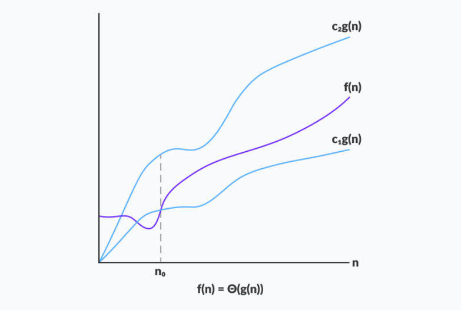
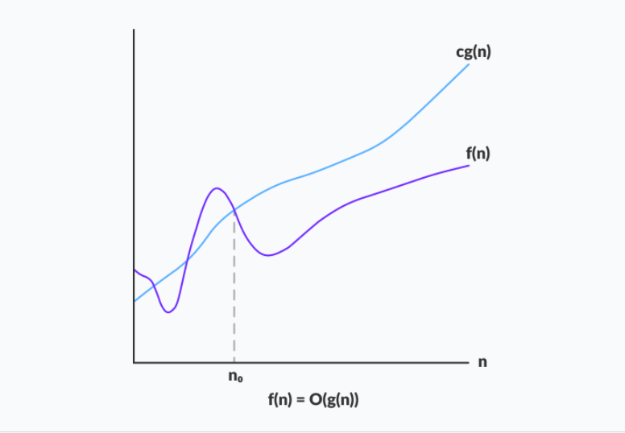
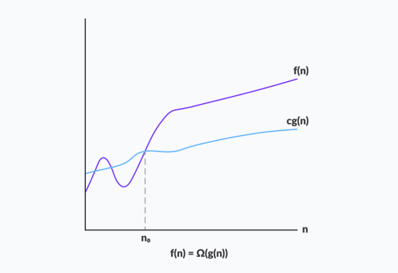
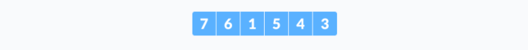
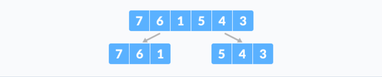
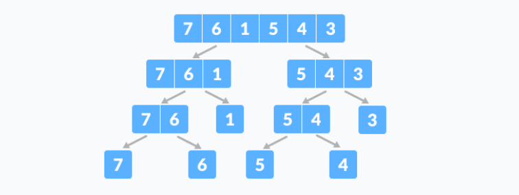
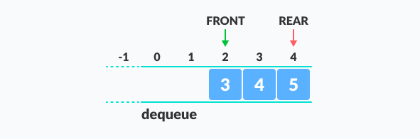
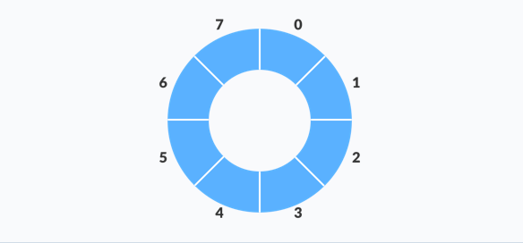

# What is an Algorithm?

An algorithm is a set of well-defined instructions in sequence to solve a problem.

## Qualities of a good algorithm

1. Input and output should be defined precisely.
2. Each step in the algorithm should be clear and unambiguous.
3. Algorithms should be most effective among many different ways to solve a problem.
4. An algorithm shouldn't include computer code. Instead, the algorithm should be written in such a way that it can be used in different programming languages.

## Examples Of Algorithms In Programming

**Write an algorithm to add two numbers entered by the user.**

```
Step 1: Start
Step 2: Declare variables num1, num2 and sum. 
Step 3: Read values num1 and num2. 
Step 4: Add num1 and num2 and assign the result to sum.
        sum←num1+num2 
Step 5: Display sum 
Step 6: Stop
```

**Write an algorithm to find the largest among three different numbers entered by the user.**

```
Step 1: Start
Step 2: Declare variables a,b and c.
Step 3: Read variables a,b and c.
Step 4: If a > b
           If a > c
              Display a is the largest number.
           Else
              Display c is the largest number.
        Else
           If b > c
              Display b is the largest number.
           Else
              Display c is the greatest number.  
Step 5: Stop
```

**Write an algorithm to find all roots of a quadratic equation ax****2****+bx+c=0.**

```
Step 1: Start
Step 2: Declare variables a, b, c, D, x1, x2, rp and ip;
Step 3: Calculate discriminant
         D ← b2-4ac
Step 4: If D ≥ 0
              r1 ← (-b+√D)/2a
              r2 ← (-b-√D)/2a 
              Display r1 and r2 as roots.
        Else     
              Calculate real part and imaginary part
              rp ← -b/2a
              ip ← √(-D)/2a
              Display rp+j(ip) and rp-j(ip) as roots
Step 5: Stop             
```

**Write an algorithm to find the factorial of a number entered by the user.**

```
Step 1: Start
Step 2: Declare variables n, factorial and i.
Step 3: Initialize variables
          factorial ← 1
          i ← 1
Step 4: Read value of n
Step 5: Repeat the steps until i = n
     5.1: factorial ← factorial*i
     5.2: i ← i+1
Step 6: Display factorial
Step 7: Stop
```

**Write an algorithm to check whether a number entered by the user is prime or not.**

```
Step 1: Start
Step 2: Declare variables n, i, flag.
Step 3: Initialize variables
        flag ← 1
        i ← 2  
Step 4: Read n from the user.
Step 5: Repeat the steps until i=(n/2)
     5.1 If remainder of n÷i equals 0
            flag ← 0
            Go to step 6
     5.2 i ← i+1
Step 6: If flag = 0
           Display n is not prime
        else
           Display n is prime
Step 7: Stop 
```

**Write an algorithm to find the Fibonacci series till term≤1000.**

```
Step 1: Start 
Step 2: Declare variables first_term,second_term and temp. 
Step 3: Initialize variables first_term ← 0 second_term ← 1 
Step 4: Display first_term and second_term 
Step 5: Repeat the steps until second_term ≤ 1000 
     5.1: temp ← second_term 
     5.2: second_term ← second_term + first_term 
     5.3: first_term ← temp 
     5.4: Display second_term 
Step 6: Stop
```

# Asymptotic Analysis

The efficiency of an algorithm depends on the amount of time, storage and other resources required to execute the algorithm. The efficiency is measured with the help of asymptotic notations.

An algorithm may not have the same performance for different types of inputs. With the increase in the input size, the performance will change.

The study of change in performance of the algorithm with the change in the order of the input size is defined as asymptotic analysis.

## Asymptotic Notations

Asymptotic notations are the mathematical notations used to describe the running time of an algorithm when the input tends towards a particular value or a limiting value.

For example: In bubble sort, when the input array is already sorted, the time taken by the algorithm is linear i.e. the best case.

But, when the input array is in reverse condition, the algorithm takes the maximum time (quadratic) to sort the elements i.e. the worst case.

When the input array is neither sorted nor in reverse order, then it takes average time. These durations are denoted using asymptotic notations.

There are mainly three asymptotic notations: Theta notation, Omega notation and Big-O notation.

## Theta Notation (Θ-notation)

Theta notation encloses the function from above and below. Since it represents the upper and the lower bound of the running time of an algorithm, it is used for analyzing the average case complexity of an algorithm.

For a function `g(n)`, `Θ(g(n))` is given by the relation:

```
Θ(g(n)) = { f(n): there exist positive constants c1, c2 and n0
            such that 0 ≤ c1g(n) ≤ f(n) ≤ c2g(n) for all n ≥ n0 }
```

The above expression can be described as a function `f(n)` belongs to the set `Θ(g(n))` if there exist positive constants `c1` and `c2` such that it can be sandwiched between `c1g(n)` and `c2g(n)`, for sufficiently large n.

If a function `f(n)` lies anywhere in between `c1g(n)` and `c2 > g(n)` for all `n ≥ n0`, then `f(n)` is said to be asymptotically tight bound.

## Big-O Notation (O-notation)

Big-O notation represents the upper bound of the running time of an algorithm. Thus, it gives the worst case complexity of an algorithm.



```
O(g(n)) = { f(n): there exist positive constants c and n0
            such that 0 ≤ f(n) ≤ cg(n) for all n ≥ n0 }
```

The above expression can be described as a function `f(n)` belongs to the set `O(g(n))` if there exists a positive constant `c` such that it lies between `0` and `cg(n)`, for sufficiently large `n`.

For any value of `n`, the running time of an algorithm does not cross time provided by `O(g(n))`.

Since it gives the worst case running time of an algorithm, it is widely used to analyze an algorithm as we are always interested in the worst case scenario.

## Omega Notation (Ω-notation)

Omega notation represents the lower bound of the running time of an algorithm. Thus, it provides best case complexity of an algorithm.



```
Ω(g(n)) = { f(n): there exist positive constants c and n0 
            such that 0 ≤ cg(n) ≤ f(n) for all n ≥ n0 }
```

The above expression can be described as a function `f(n)` belongs to the set `Ω(g(n))` if there exists a positive constant `c` such that it lies above `cg(n)`, for sufficiently large `n`.

For any value of `n`, the minimum time required by the algorithm is given by Omega `Ω(g(n))`

The master method is a formula for solving recurrence relations of the form:

```
T(n) = aT(n/b) + f(n),
where,
n = size of input
a = number of subproblems in the recursion
n/b = size of each subproblem. All subproblems are assumed 
     to have the same size.
f(n) = cost of the work done outside the recursive call, 
      which includes the cost of dividing the problem and
      cost of merging the solutions

Here, a ≥ 1 and b > 1 are constants, and f(n) is an asymptotically positive function.
```

An asymptotically positive function means that for a sufficiently large value of n, we have `f(n) > 0`.

Master theorem is used in calculating the time complexity of recurrence relations (divide and conquer algorithms) in a simple and quick way.

## Common Asymptotic Notations

Following is a list of some common asymptotic notations −

| constant    | −    | Ο(1)       |
| ----------- | ---- | ---------- |
| logarithmic | −    | Ο(log n)   |
| linear      | −    | Ο(n)       |
| n log n     | −    | Ο(n log n) |
| quadratic   | −    | Ο(n2)      |
| cubic       | −    | Ο(n3)      |
| polynomial  | −    | nΟ(1)      |
| exponential | −    | 2Ο(n)      |

# Master Theorem

## Master Theorem

If `a ≥ 1` and `b > 1` are constants and `f(n)` is an asymptotically positive function, then the time complexity of a recursive relation is given by

```
T(n) = aT(n/b) + f(n)

where, T(n) has the following asymptotic bounds:

    1. If f(n) = O(nlogb a-ϵ), then T(n) = Θ(nlogb a).

    2. If f(n) = Θ(nlogb a), then T(n) = Θ(nlogb a * log n).

    3. If f(n) = Ω(nlogb a+ϵ), then T(n) = Θ(f(n)).

ϵ > 0 is a constant.
```


Each of the above conditions can be interpreted as:

1. If the cost of solving the sub-problems at each level increases by a certain factor, the value of `f(n)` will become polynomially smaller than `nlogb a`. Thus, the time complexity is oppressed by the cost of the last level ie. `nlogb a`
2. If the cost of solving the sub-problem at each level is nearly equal, then the value of `f(n)` will be `nlogb a`. Thus, the time complexity will be `f(n)` times the total number of levels ie. `nlogb a * log n`
3. If the cost of solving the subproblems at each level decreases by a certain factor, the value of `f(n)` will become polynomially larger than `nlogb a`. Thus, the time complexity is oppressed by the cost of `f(n)`.

------

## Solved Example of Master Theorem

```
T(n) = 3T(n/2) + n2
Here,
a = 3
n/b = n/2
f(n) = n2

logb a = log2 3 ≈ 1.58 < 2

ie. f(n) < nlogb a+ϵ , where, ϵ is a constant.

Case 3 implies here.

Thus, T(n) = f(n) = Θ(n2) 
```

------

## Master Theorem Limitations

The master theorem cannot be used if:

- T(n) is not monotone. eg. `T(n) = sin n`
- `f(n)` is not a pilynomial. eg. `f(n) = 2n`
- a is not a constant. eg. `a = 2n`
- `a < 1`

# Divide and Conquer Algorithm

A **divide and conquer algorithm** is a strategy of solving a large problem by

1. breaking the problem into smaller sub-problems
2. solving the sub-problems, and
3. combining them to get the desired output.

## How Divide and Conquer Algorithms Work?

Here are the steps involved:

1. **Divide** : Divide the given problem into sub-problems using recursion.
2. **Conquer**: Solve the smaller sub-problems recursively. If the subproblem is small enough, then solve it directly.
3. **Combine:** Combine the solutions of the sub-problems which is part of the recursive process to get the solution to the actual problem.

Let us understand this concept with the help of an example.

Here, we are going to sort an array using the divide and conquer approach (ie. [merge sort](https://www.programiz.com/dsa/merge-sort)).

1. Let the given array be:

2. **Divide** the array into two halves.

   Again, divide each subpart recursively into two halves until you get individual elements.

3. Now, combine the individual elements in a sorted manner. Here, **conquer** and **combine** steps go side by side.

## Complexity

The complexity of the divide and conquer algorithm is calculated using [the master theorem](https://www.programiz.com/dsa/master-theorem).

```
T(n) = aT(n/b) + f(n),
where,
n = size of input
a = number of subproblems in the recursion
n/b = size of each subproblem. All subproblems are assumed to have the same size.
f(n) = cost of the work done outside the recursive call, which includes the cost of dividing the problem and cost of merging the solutions
```

Let us take an example to find the time complexity of a recursive problem.

For a merge sort, the equation can be written as:

```
T(n) = aT(n/b) + f(n)
     = 2T(n/2) + O(n)
Where, 
a = 2 (each time, a problem is divided into 2 subproblems)
n/b = n/2 (size of each sub problem is half of the input)
f(n) = time taken to divide the problem and merging the subproblems
T(n/2) = O(n log n) (To understand this, please refer to the master theorem.)

Now, T(n) = 2T(n log n) + O(n)
          ≈ O(n log n)
```

## Divide and Conquer vs Dynamic approach

The divide and conquer approach divides a problem into smaller subproblems, these subproblems are further solved recursively. The result of each subproblem is not stored for future reference, whereas, in a dynamic approach, the result of each subproblem is stored for future reference.

Use the divide and conquer approach when the same subproblem is not solved multiple times. Use the dynamic approach when the result of a subproblem is to be used multiple times in the future.

Let us understand this with an example. Suppose we are trying to find the Fibonacci series. Then,

**Divide and Conquer approach:**

```
fib(n)
    If n < 2, return 1
    Else , return f(n - 1) + f(n -2)
```

**Dynamic approach:**

```
mem = [ ]
fib(n)
    If n in mem: return mem[n] 
    else,     
        If n < 2, f = 1
        else , f = f(n - 1) + f(n -2)
        mem[n] = f
        return f
```

In a dynamic approach, mem stores the result of each subproblem.

------

## Advantage of Divide and Conquer Algorithm

- The complexity for the multiplication of two matrices using the naive method is O(n3), whereas using the divide and conquer approach (ie. Strassen's matrix multiplication) is O(n2.8074). Other problems such as the Tower of Hanoi are also simplified by this approach.
- This approach is suitable for multiprocessing systems.
- It makes efficient use of memory caches.

------

## Divide and Conquer Application

- Binary search
- Merge sort
- Quick sort
- Strassen's Matrix multiplication
- Karatsuba Algorithm

# Stack

A stack is a useful data structure in programming. It is just like a pile of plates kept on top of each other.

It follows **the Last In First Out(LIFO)** principle.

A stack can be implemented by means of Array, Structure, Pointer, and Linked List. Stack can either be a fixed size one or it may have a sense of dynamic resizing. Here, we are going to implement stack using arrays, which makes it a fixed size stack implementation.

## Basic Operations of Stack

A stack is an object or more specifically an abstract data structure(ADT) that allows the following operations:

- `Push`: Add an element to the top of a stack
- `Pop`: Remove an element from the top of a stack
- `IsEmpty`: Check if the stack is empty
- `IsFull`: Check if the stack is full
- `Peek`: Get the value of the top element without removing it

## Working of Stack Data Structure

The operations work as follows:

1. A pointer called TOP is used to keep track of the top element in the stack.
2. When initializing the stack, we set its value to -1 so that we can check if the stack is empty by comparing `TOP == -1`.
3. On pushing an element, we increase the value of TOP and place the new element in the position pointed to by TOP.
4. On popping an element, we return the element pointed to by TOP and reduce its value.
5. Before pushing, we check if the stack is already full
6. Before popping, we check if the stack is already empty

## Stack Implementations in Python

```python
# Stack implementation in python


# Creating a stack
def create_stack():
    stack = []
    return stack


# Creating an empty stack
def check_empty(stack):
    return len(stack) == 0


# Adding items into the stack
def push(stack, item):
    stack.append(item)
    print("pushed item: " + item)


# Removing an element from the stack
def pop(stack):
    if (check_empty(stack)):
        return "stack is empty"

    return stack.pop()


stack = create_stack()
push(stack, str(1))
push(stack, str(2))
push(stack, str(3))
push(stack, str(4))
print("popped item: " + pop(stack))
print("stack after popping an element: " + str(stack))
```

## Stack Implementations in C++

```c++
// Stack implementation in C++

#include <stdlib.h>
#include <iostream>

using namespace std;

#define MAX 10
int size = 0;

// Creating a stack
struct stack {
  int items[MAX];
  int top;
};
typedef struct stack st;

void createEmptyStack(st *s) {
  s->top = -1;
}

// Check if the stack is full
int isfull(st *s) {
  if (s->top == MAX - 1)
    return 1;
  else
    return 0;
}

// Check if the stack is empty
int isempty(st *s) {
  if (s->top == -1)
    return 1;
  else
    return 0;
}

// Add elements into stack
void push(st *s, int newitem) {
  if (isfull(s)) {
    printf("STACK FULL");
  } else {
    s->top++;
    s->items[s->top] = newitem;
  }
  size++;
}

// Remove element from stack
void pop(st *s) {
  if (isempty(s)) {
    printf("\n STACK EMPTY \n");
  } else {
    printf("Item popped= %d", s->items[s->top]);
    s->top--;
  }
  size--;
  cout << endl;
}

// Print elements of stack
void printStack(st *s) {
  printf("Stack: ");
  for (int i = 0; i < size; i++) {
    cout << s->items[i] << " ";
  }
  cout << endl;
}

// Driver code
int main() {
  int ch;
  st *s = (st *)malloc(sizeof(st));

  createEmptyStack(s);

  push(s, 1);
  push(s, 2);
  push(s, 3);
  push(s, 4);

  printStack(s);

  pop(s);

  cout << "\nAfter popping out\n";
  printStack(s);
}
```

## Stack Time Complexity

For the array-based implementation of a stack, the push and pop operations take constant time i.e. `O(1)` because there is only a movement of the pointer in both the cases.

## Applications of Stack Data Structure

Although stack is a simple data structure to implement, it is very powerful. The most common uses of a stack are:

- **To reverse a word** - Put all the letters in a stack and pop them out. Because of the LIFO order of stack, you will get the letters in reverse order.
- **In compilers** - Compilers use the stack to calculate the value of expressions like `2 + 4 / 5 * (7 - 9)` by converting the expression to prefix or postfix form.
- **In browsers** - The back button in a browser saves all the URLs you have visited previously in a stack. Each time you visit a new page, it is added on top of the stack. When you press the back button, the current URL is removed from the stack and the previous URL is accessed.

# Queue

A queue is a useful data structure in programming. It is similar to the ticket queue outside a cinema hall, where the first person entering the queue is the first person who gets the ticket.

Queue follows the **First In First Out(FIFO)** rule - the item that goes in first is the item that comes out first too

## Basic Operations of Queue

A queue is an object or more specifically an abstract data structure(ADT) that allows the following operations:

- **Enqueue**: Add an element to the end of the queue
- **Dequeue**: Remove an element from the front of the queue
- **IsEmpty**: Check if the queue is empty
- **IsFull**: Check if the queue is full
- **Peek**: Get the value of the front of the queue without removing it

## Working of Queue

Queue operations work as follows:

- two pointers FRONT and REAR
- FRONT track the first element of the queue
- REAR track the last elements of the queue
- initially, set value of FRONT and REAR to -1

### Enqueue Operation

- check if the queue is full
- for the first element, set value of FRONT to 0
- increase the REAR index by 1
- add the new element in the position pointed to by REAR

### Dequeue Operation

- check if the queue is empty
- return the value pointed by FRONT
- increase the FRONT index by 1
- for the last element, reset the values of FRONT and REAR to -1


## Queue Implementation in Python

```python
# Queue implementation in Python

class Queue:

    def __init__(self):
        self.queue = []

    # Add an element
    def enqueue(self, item):
        self.queue.append(item)
    
    # Remove an element 
    def dequeue(self):
        if len(self.queue) < 1:
            return None
        return self.queue.pop(0)

    # Display the queue
    def display(self):
        print(self.queue)

    def size(self):
        return len(self.queue)


q = Queue()
q.enqueue(1)
q.enqueue(2)
q.enqueue(3)
q.enqueue(4)
q.enqueue(5)

q.display()
q.dequeue()

print("After removing an element")
q.display()
```

## Queue Implementation in C++

```python
// Queue implementation in C++

#include <iostream>
#define SIZE 5

using namespace std;

class Queue {
   private:
  int items[SIZE], front, rear;

   public:
  Queue() {
    front = -1;
    rear = -1;
  }

  bool isFull() {
    if (front == 0 && rear == SIZE - 1) {
      return true;
    }
    return false;
  }

  bool isEmpty() {
    if (front == -1)
      return true;
    else
      return false;
  }

  void enQueue(int element) {
    if (isFull()) {
      cout << "Queue is full";
    } else {
      if (front == -1) front = 0;
      rear++;
      items[rear] = element;
      cout << endl
         << "Inserted " << element << endl;
    }
  }

  int deQueue() {
    int element;
    if (isEmpty()) {
      cout << "Queue is empty" << endl;
      return (-1);
    } else {
      element = items[front];
      if (front >= rear) {
        front = -1;
        rear = -1;
      } /* Q has only one element, so we reset the queue after deleting it. */
      else {
        front++;
      }
      cout << endl
         << "Deleted -> " << element << endl;
      return (element);
    }
  }

  void display() {
    /* Function to display elements of Queue */
    int i;
    if (isEmpty()) {
      cout << endl
         << "Empty Queue" << endl;
    } else {
      cout << endl
         << "Front index-> " << front;
      cout << endl
         << "Items -> ";
      for (i = front; i <= rear; i++)
        cout << items[i] << "  ";
      cout << endl
         << "Rear index-> " << rear << endl;
    }
  }
};

int main() {
  Queue q;

  //deQueue is not possible on empty queue
  q.deQueue();

  //enQueue 5 elements
  q.enQueue(1);
  q.enQueue(2);
  q.enQueue(3);
  q.enQueue(4);
  q.enQueue(5);

  //6th element can't be added to queue because queue is full
  q.enQueue(6);

  q.display();

  //deQueue removes element entered first i.e. 1
  q.deQueue();

  //Now we have just 4 elements
  q.display();

  return 0;
}
```

## Limitation of Queue

As you can see in the image below, after a bit of enqueuing and dequeuing, the size of the queue has been reduced.


The indexes 0 and 1 can only be used after the queue is reset when all the elements have been dequeued.

After REAR reaches the last index, if we can store extra elements in the empty spaces (0 and 1), we can make use of the empty spaces. This is implemented by a modified queue called the **Circular queue**

## Complexity Analysis

The complexity of enqueue and dequeue operations in a queue using an array is `O(1)`.

------

## Applications of Queue Data Structure

- CPU scheduling, Disk Scheduling
- When data is transferred asynchronously between two processes.The queue is used for synchronization. eg: IO Buffers, pipes, file IO, etc
- Handling of interrupts in real-time systems.
- Call Center phone systems use Queues to hold people calling them in an order

## Types of Queue

### Simple Queue

In a simple queue, insertion takes place at the rear and removal occurs at the front. It strictly follows FIFO rule.


### Circular Queue 

Circular queue avoids the wastage of space in a regualr queue implementation using arrays.



As you can see in the above image, after a bit of enqueuing and dequeuing, the size of the queue has been reduced.

The indexes 0 and 1 can only be used after the queue is reset when all the elements have been dequeued.

#### How Circular Queue Works

Circular Queue works by the process of circular increment i.e. when we try to increment the pointer and we reach the end of the queue, we start from the beginning of the queue.

Here, the circular increment is performed by modulo division with the queue size. That is,

```
if REAR + 1 == 5 (overflow!), REAR = (REAR + 1)%5 = 0 (start of queue)
```



#### Circular Queue Operations

The circular queue work as follows:

- two pointers FRONT and REAR
- FRONT track the first element of the queue
- REAR track the last elements of the queue
- initially, set value of FRONT and REAR to -1

##### 1. Enqueue Operation

- check if the queue is full
- for the first element, set value of FRONT to 0
- circularly increase the REAR index by 1 (i.e. if the rear reaches the end, next it would be at the start of the queue)
- add the new element in the position pointed to by REAR

##### 2. Dequeue Operation

- check if the queue is empty
- return the value pointed by FRONT
- circularly increase the FRONT index by 1
- for the last element, reset the values of FRONT and REAR to -1


However, the check for full queue has a new additional case:

- Case 1: FRONT = 0 && `REAR == SIZE - 1`
- Case 2: `FRONT = REAR + 1`

The second case happens when REAR starts from 0 due to circular increment and when its value is just 1 less than FRONT, the queue is full.


#### Circular Queue Implementation in Python

```python
# Circular Queue

class CircularQueue():

    def __init__(self, k):
        self.k = k
        self.queue = [None] * k
        self.head = self.tail = -1

    # Insert an element into the circular queue
    def enqueue(self, data):

        if ((self.tail + 1) % self.k == self.head):
            print("The circular queue is full\n")
        
        elif (self.head == -1):
            self.head = 0
            self.tail = 0
            self.queue[self.tail] = data
        else:
            self.tail = (self.tail + 1) % self.k
            self.queue[self.tail] = data
    
    # Delete an element from the circualr queue 
    def dequeue(self):
        if (self.head == -1):
            print("No element in the circular queue")

        elif (self.tail == self.head):
            temp = self.queue[self.head]
            self.head = -1
            self.tail = -1
            return temp
        else:
            temp = self.queue[self.head]
            self.head = (self.head + 1) % self.k
            return temp

    def printCQueue(self):
        if (self.head == -1):
            print("No element in the circular queue")
        
        elif (self.tail >= self.head):
            for i in range(self.head, self.tail +1 ):
                print(self.queue[i], end=" ")
            print()
        else:
            for i in range(self.head, self.k):
                print(self.queue[i], end=" ")


obj = CircularQueue(5)
obj.enqueue(1)
obj.enqueue(2)
obj.enqueue(3)
obj.enqueue(4)
obj.enqueue(5)
print("Initial queue")
obj.printCQueue()

obj.dequeue()
obj.dequeue()
obj.dequeue()
print("After removing an element from the queue")
obj.printCQueue()
```

#### Cicular Queue Implementation in C++

```c++
// Circular Queue implementation in C++

#include <iostream>
#define SIZE 5 /* Size of Circular Queue */

using namespace std;

class Queue {
   private:
  int items[SIZE], front, rear;

   public:
  Queue() {
    front = -1;
    rear = -1;
  }
  // Check if the queue is full
  bool isFull() {
    if (front == 0 && rear == SIZE - 1) {
      return true;
    }
    if (front == rear + 1) {
      return true;
    }
    return false;
  }
  // Check if the queue is empty
  bool isEmpty() {
    if (front == -1)
      return true;
    else
      return false;
  }
  // Adding an element
  void enQueue(int element) {
    if (isFull()) {
      cout << "Queue is full";
    } else {
      if (front == -1) front = 0;
      rear = (rear + 1) % SIZE;
      items[rear] = element;
      cout << endl
         << "Inserted " << element << endl;
    }
  }
  // Removing an element
  int deQueue() {
    int element;
    if (isEmpty()) {
      cout << "Queue is empty" << endl;
      return (-1);
    } else {
      element = items[front];
      if (front == rear) {
        front = -1;
        rear = -1;
      }
      // Q has only one element,
      // so we reset the queue after deleting it.
      else {
        front = (front + 1) % SIZE;
      }
      return (element);
    }
  }

  void display() {
    // Function to display status of Circular Queue
    int i;
    if (isEmpty()) {
      cout << endl
         << "Empty Queue" << endl;
    } else {
      cout << "Front -> " << front;
      cout << endl
         << "Items -> ";
      for (i = front; i != rear; i = (i + 1) % SIZE)
        cout << items[i];
      cout << items[i];
      cout << endl
         << "Rear -> " << rear;
    }
  }
};

int main() {
  Queue q;

  // Fails because front = -1
  q.deQueue();

  q.enQueue(1);
  q.enQueue(2);
  q.enQueue(3);
  q.enQueue(4);
  q.enQueue(5);

  // Fails to enqueue because front == 0 && rear == SIZE - 1
  q.enQueue(6);

  q.display();

  int elem = q.deQueue();

  if (elem != -1)
    cout << endl
       << "Deleted Element is " << elem;

  q.display();

  q.enQueue(7);

  q.display();

  // Fails to enqueue because front == rear + 1
  q.enQueue(8);

  return 0;
}
```

#### Circular Queue Complexity Analysis

The complexity of the enqueue and dequeue operations of a circular queue is O(1) for (array implementations).

------

#### Applications of Circular Queue

- CPU scheduling
- Memory management
- Traffic Management

### Priority Queue

A priority queue is a special type of queue in which each element is associated with a priority and is served according to its priority. If elements with the same priority occur, they are served according to their order in the queue.

Generally, the value of the element itself is considered for assigning the priority.

For example, The element with the highest value is considered as the highest priority element. However, in other cases, we can assume the element with the lowest value as the highest priority element. In other cases, we can set priorities according to our needs.

#### Difference between Priority Queue and Normal Queue

In a queue, the **first-in-first-out rule** is implemented whereas, in a priority queue, the values are removed **on the basis of priority**. The element with the highest priority is removed first.

#### Implementation of Priority Queue

Priority queue can be implemented using an array, a linked list, a heap data structure, or a binary search tree. Among these data structures, heap data structure provides an efficient implementation of priority queues.

A comparative analysis of different implementations of priority queue is given below.

| Operations         | peek   | insert     | delete     |
| :----------------- | :----- | :--------- | :--------- |
| Linked List        | `O(1)` | `O(n)`     | `O(1)`     |
| Binary Heap        | `O(1)` | `O(log n)` | `O(log n)` |
| Binary Search Tree | `O(1)` | `O(log n)` | `O(log n)` |

#### Priority Queue Implementation in Python

```python
# Priority Queue implementation in Python


# Function to heapify the tree
def heapify(arr, n, i):
    # Find the largest among root, left child and right child
    largest = i
    l = 2 * i + 1
    r = 2 * i + 2

    if l < n and arr[i] < arr[l]:
        largest = l

    if r < n and arr[largest] < arr[r]:
        largest = r

    # Swap and continue heapifying if root is not largest
    if largest != i:
        arr[i], arr[largest] = arr[largest], arr[i]
        heapify(arr, n, largest)


# Function to insert an element into the tree
def insert(array, newNum):
    size = len(array)
    if size == 0:
        array.append(newNum)
    else:
        array.append(newNum)
        for i in range((size // 2) - 1, -1, -1):
            heapify(array, size, i)


# Function to delete an element from the tree
def deleteNode(array, num):
    size = len(array)
    i = 0
    for i in range(0, size):
        if num == array[i]:
            break

    array[i], array[size - 1] = array[size - 1], array[i]

    array.remove(size - 1)

    for i in range((len(array) // 2) - 1, -1, -1):
        heapify(array, len(array), i)


arr = []

insert(arr, 3)
insert(arr, 4)
insert(arr, 9)
insert(arr, 5)
insert(arr, 2)

print ("Max-Heap array: " + str(arr))

deleteNode(arr, 4)
print("After deleting an element: " + str(arr))
```

#### Priority Queue Implementation in C++

```C++
// Priority Queue implementation in C++

#include <iostream>
#include <vector>
using namespace std;

// Function to swap position of two elements
void swap(int *a, int *b) {
  int temp = *b;
  *b = *a;
  *a = temp;
}

// Function to heapify the tree
void heapify(vector<int> &hT, int i) {
  int size = hT.size();
  
  // Find the largest among root, left child and right child
  int largest = i;
  int l = 2 * i + 1;
  int r = 2 * i + 2;
  if (l < size && hT[l] > hT[largest])
    largest = l;
  if (r < size && hT[r] > hT[largest])
    largest = r;

  // Swap and continue heapifying if root is not largest
  if (largest != i) {
    swap(&hT[i], &hT[largest]);
    heapify(hT, largest);
  }
}

// Function to insert an element into the tree
void insert(vector<int> &hT, int newNum) {
  int size = hT.size();
  if (size == 0) {
    hT.push_back(newNum);
  } else {
    hT.push_back(newNum);
    for (int i = size / 2 - 1; i >= 0; i--) {
      heapify(hT, i);
    }
  }
}

// Function to delete an element from the tree
void deleteNode(vector<int> &hT, int num) {
  int size = hT.size();
  int i;
  for (i = 0; i < size; i++) {
    if (num == hT[i])
      break;
  }
  swap(&hT[i], &hT[size - 1]);

  hT.pop_back();
  for (int i = size / 2 - 1; i >= 0; i--) {
    heapify(hT, i);
  }
}

// Print the tree
void printArray(vector<int> &hT) {
  for (int i = 0; i < hT.size(); ++i)
    cout << hT[i] << " ";
  cout << "\n";
}

// Driver code
int main() {
  vector<int> heapTree;

  insert(heapTree, 3);
  insert(heapTree, 4);
  insert(heapTree, 9);
  insert(heapTree, 5);
  insert(heapTree, 2);

  cout << "Max-Heap array: ";
  printArray(heapTree);

  deleteNode(heapTree, 4);

  cout << "After deleting an element: ";

  printArray(heapTree);
}
```

#### Priority Queue Applications

Some of the applications of a priority queue are:

- Dijkstra's algorithm
- for implementing stack
- for load balancing and interrupt handling in an operating system
- for data compression in Huffman code