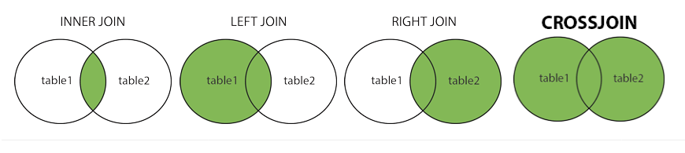

# MySQL CheatSheet

[TOC]


# Login

```shell
$ sudo mysql -u username -p 
```

# Database Operations

```mysql
-- creates a database
CREATE DATABASE database_name; 
CREATE DATABASE IF NOT EXISTS database_name; -- avoids Error 1008

-- Delete Database
DROP DATABASE IF EXISTS database_name; -- Drops a database if it exists, avoids Error 1008 
DROP DATABASE database_name; -- If database does not exist, ERROR 1008 will occur

-- See your current databases
SHOW DATABASES;

USE database_name; -- set it as the current database
```

# User Operations

```mysql
-- Show User
SELECT User, Host FROM mysql.user;

-- Create User
CREATE USER 'someuser'@'localhost' IDENTIFIED BY 'somepassword';

-- Delete User
DROP USER 'someuser'@'localhost';

-- Change Password
ALTER USER 'username'@'localhost' IDENTIFIED BY 'new_password';


FLUSH PRIVILEGES;
```


# Data Types

| MEDIUMBLOB                                               | String (0 - 16777215)                                        |
| -------------------------------------------------------- | ------------------------------------------------------------ |
| LONGTEXT                                                 | String (0 - 429496­7295)                                     |
| LONGBLOB                                                 | String (0 - 429496­7295)                                     |
| TINYINT x                                                | Integer (-128 to 127)                                        |
| SMALLINT x                                               | Integer (-32768 to 32767)                                    |
| MEDIUMINT x                                              | Integer (-8388608 to 8388607)                                |
| INT x                                                    | Integer (-2147­483648 to 214748­3647)                        |
| BIGINT x                                                 | Integer (-9223­372­036­854­775808 to 922337­203­685­477­5807) |
| FLOAT                                                    | Decimal (precise to 23 digits)                               |
| DOUBLE                                                   | Decimal (24 to 53 digits)                                    |
| DECIMAL                                                  | "­DOU­BLE­" stored as string                                 |
| DATE                                                     | YYYY-MM-DD                                                   |
| DATETIME                                                 | YYYY-MM-DD HH:MM:SS                                          |
| TIMESTAMP                                                | YYYYMM­DDH­HMMSS                                             |
| TIME                                                     | HH:MM:SS                                                     |
| [ENUM](http://dev.mysql.com/doc/refman/5.0/en/enum.html) | One of preset options                                        |
| [SET](http://dev.mysql.com/doc/refman/5.0/en/set.html)   | Selection of preset options                                  |

> **Note:** Integers (marked x) that are "­UNS­IGN­ED" have the same range of values but start from 0 (i.e., an UNSIGNED TINYINT can have any value from 0 to 255).

# Table Operations

## Create Table

```mysql
-- Create Normal Table
CREATE TABLE table (field1 type1, field2 type2);

-- Create Table with index
CREATE TABLE table (field1 type1, field2 type2, INDEX (field));

-- Create Table with primary key
CREATE TABLE table (field1 type1, field2 type2, PRIMARY KEY (field1));

-- Create Table with multiple primary key
CREATE TABLE table (field1 type1, field2 type2, PRIMARY KEY (field1,field2));


CREATE TABLE table1 (fk_field1 type1, field2 type2, ...,
  FOREIGN KEY (fk_field1) REFERENCES table2 (t2_fieldA))
    [ON UPDATE|ON DELETE] [CASCADE|SET NULL]

-- create table with foregin key
CREATE TABLE table1 (fk_field1 type1, fk_field2 type2, ...,
 FOREIGN KEY (fk_field1, fk_field2) REFERENCES table2 (t2_fieldA, t2_fieldB))
 
 -- Create table if not exists 
CREATE TABLE table IF NOT EXISTS;

-- Create table by cloning 
CREATE TABLE cloned_table_name LIKE table_name;
CREATE TABLE cloned_table_name SELECT * FROM table_name;

-- create a table from another table in the same database with some attributes
CREATE TABLE cloned_table_name  AS SELECT col_name_1, col_name_2 FROM table_name;

-- Create table by using where condition
CREATE TABLE cloned_table_name SELECT * FROM table_name WHERE condition;
CREATE TABLE cloned_table_name SELECT col_name, col_name2, .. WHERE condition;

```

The following constraints are commonly used in SQL:

- `NOT NULL` - Ensures that a column cannot have a NULL value
- `UNIQUE` - Ensures that all values in a column are different
- `PRIMARY KEY` - A combination of a `NOT NULL` and `UNIQUE`. Uniquely identifies each row in a table
- `FOREIGN KEY` - Prevents actions that would destroy links between tables
- `CHECK` - Ensures that the values in a column satisfies a specific condition
- `DEFAULT` - Sets a default value for a column if no value is specified
- `CREATE INDEX` - Used to create and retrieve data from the database very quickly

```mysql
-- Create Table with constraints
CREATE TABLE user(
	id INT NOT NULL AUTO_INCREMENT,
  name VARCHAR(255) NOT NULL,
  email VARCHAR(255) NOT NULL UNIQUE,
  phone VARCHAR(255),
  country VARCHAR(255) DEFAULT "India",
  age INT CHECK (age>=18),
  PRIMARY KEY (id),
  FOREIGN KEY (PersonID) REFERENCES Persons(PersonID)
);
```

## Get Table Info

```mysql
DESC table_name;
```

## Insert into Table

```mysql
-- Specify both the column names and the values to be inserted
INSERT INTO table_name (column1, column2, column3, ...) VALUES (value1, value2, value3, ...);

-- Make sure the order of the values is in the same order as the columns in the table
INSERT INTO table_name VALUES (value1, value2, value3, ...);

-- Multiple values
INSERT INTO table_name (column1, column2, column3, ...) VALUES 
(value1, value2, value3, ...),
(value1, value2, value3, ...),
(value1, value2, value3, ...)..;
```

## Select table

```mysql
SELECT * FROM table;
SELECT * FROM table1, table2;
SELECT field1, field2 FROM table1, table2;
SELECT ... FROM ... WHERE condition
SELECT ... FROM ... WHERE condition GROUPBY field;
SELECT ... FROM ... WHERE condition GROUPBY field HAVING condition2;
SELECT ... FROM ... WHERE condition ORDER BY field1, field2;
SELECT ... FROM ... WHERE condition ORDER BY field1, field2 DESC;
SELECT ... FROM ... WHERE condition LIMIT 10;
SELECT DISTINCT field1 FROM ...
SELECT DISTINCT field1, field2 FROM ...
```

## Alter table

```mysql
-- add new column
ALTER TABLE table_name ADD COLUMN field1 type1 contraints;
ALTER TABLE table_name ADD COLUMN field1 Datatype contraints, field2 type1; 

-- Drop column
ALTER TABLE table_name DROP COLUMN field1;
ALTER TABLE table_name DROP COLUMN field1, field2;

-- modify type column
ALTER TABLE table_name MODIFY COLUMN field1 type1 contraints; 

-- change type and name of column
ALTER TABLE table_name CHANGE old_field1 new_field1 type1 contrainsts; 

-- add new column after existing column 
ALTER TABLE table_name ADD COLUMN field1 type1 AFTER another_column(A);

-- add new column at first location
ALTER TABLE table_name ADD field1 type1 FIRST

-- Droping Primary key
ALTER TABLE table_name DROP PRIMARY KEY;

-- drop foreign key
ALTER TABLE table_mame DROP FOREIGN KEY FK_name;

-- Change auto-increment value
ALTER TABLE your_table_name AUTO_INCREMENT = 101;

-- Rename Table
RENAME TABLE old_table_name TO new_table_name;
ALTER TABLE old_table_name RENAME TO new_table_name;
```

## Drop/Truncate Table

```mysql
DROP TABLE table_name
TRUNCATE TABLE table_name
```

## Indexing

```mysql
-- Creating index
CREATE INDEX index_name ON table_name (column1, column2, ...);

-- Creates a unique index on a table. Duplicate values are not allowed
CREATE UNIQUE INDEX index_name ON table_name (column1, column2, ...);

-- Droping index
ALTER TABLE table_name DROP INDEX index_name;
```

# Constraints

## NOT NULL

```mysql
CREATE TABLE table_name (
    field1 type NOT NULL,
    field2 type NOT NULL,
    field3 type NOT NULL,
    field4 type
);

ALTER TABLE table_name MODIFY field1 type NOT NULL;
```

## UNIQUE

```mysql
CREATE TABLE table_name (
    field1 type NOT NULL,
    field2 type NOT NULL UNIQUE,
    field3 type NOT NULL,
    field4 type,
    UNIQUE (field1)
);

-- UNIQUE constraint on multiple columns
CREATE TABLE table_name (
    field1 type NOT NULL,
    field2 type NOT NULL,
    field3 type,
    field4 type,
    CONSTRAINT constraint_name UNIQUE (field1, field2)
);

-- Alter 
ALTER TABLE table_name ADD UNIQUE (field_name);
ALTER TABLE table_name ADD CONSTRAINT constraint_name UNIQUE (field1, field2);
```

## PRIMARY KEY

```mysql
CREATE TABLE table_name (
    field1 type NOT NULL,
    field2 type NOT NULL UNIQUE,
    field3 type NOT NULL,
    field4 type,
    PRIMARY KEY (field_name)
);

-- PRIMARY KEY constraint on multiple columns
CREATE TABLE table_name (
    field1 type NOT NULL,
    field2 type NOT NULL,
    field3 type,
    field4 type,
    CONSTRAINT constraint_name PRIMARY KEY (field1, field2)
);

-- Alter 
ALTER TABLE table_name ADD PRIMARY KEY (field_name);
ALTER TABLE table_name ADD CONSTRAINT constraint_name PRIMARY KEY (field1, field2);

ALTER TABLE table_name DROP PRIMARY KEY;
```

## FOREIGN KEY

```mysql
CREATE TABLE table_name (
    field1 type NOT NULL,
    field2 type NOT NULL UNIQUE,
    field3 type NOT NULL,
    field4 type,
    PRIMARY KEY (field_name)
    FOREIGN KEY (field_name) REFERENCES table_name2(field_from_table2)
);

-- Foreign key on multiple column with some rules 
CREATE TABLE Vineyard (
    VineyardID smallint auto_increment,
    VineyardName VARCHAR(45) NOT NULL,
    FarmerID    smallint,
    GrapeID smallint,
    ComeFrom    varchar(45) NOT NULL,
    HarvestedAmount int,
    RipenessPercent int,
    PRIMARY KEY (VineyardID),
    FOREIGN KEY (FarmerID) REFERENCES Worker(WorkerID)
        ON DELETE SET NULL
        ON UPDATE CASCADE,
    FOREIGN KEY (GrapeID) REFERENCES Grape(GrapeID)
        ON DELETE SET NULL
        ON UPDATE CASCADE
)Engine=InnoDB;
```

## CHECK

```mysql
CREATE TABLE table_name (
    field1 type NOT NULL,
    field2 type NOT NULL UNIQUE,
    field3 type NOT NULL,
    field4 type,
    PRIMARY KEY (field_name)
    FOREIGN KEY (field_name) REFERENCES table_name2(field_from_table2)
    field5 type CHECK (field5 >= condition)
);

-- CHECK constraint on multiple columns
CREATE TABLE table_name (
    field1 type NOT NULL,
    field2 type NOT NULL,
    field3 type,
    field4 type,
    CONSTRAINT constraint_name CHECK  (condition1 AND condition2)
);

-- Alter 
ALTER TABLE table_name ADD CONSTRAINT constraint_name CHECK (conditions);

ALTER TABLE table_name DROP CHECK constraint_name;
```

## DEFAULT

```mysql
CREATE TABLE table_name (
    field1 type NOT NULL,
    field2 type NOT NULL UNIQUE,
    field3 type NOT NULL,
    field4 type DEFAULT 'value'
);

ALTER TABLE table_name ALTER field_name SET DEFAULT 'Value';

ALTER TABLE table_name ALTER field_name DROP DEFAULT;
```

## AUTO_INCREMENT

```mysql
CREATE TABLE table_name (
    field1 type NOT NULL AUTO_INCREMENT,
    field2 type NOT NULL,
    field3 type,
);

ALTER TABLE table_name AUTO_INCREMENT=100;
```

# With `WHERE` Clause

`SELECT * FROM table_name WHERE condition;`

## Normal Conditions

| Operator | Description                                                  |
| :------- | :----------------------------------------------------------- |
| =        | Equal                                                        |
| >        | Greater than                                                 |
| <        | Less than                                                    |
| >=       | Greater than or equal                                        |
| <=       | Less than or equal                                           |
| <>       | Not equal. **Note:** In some versions of SQL this operator may be written as != |
| BETWEEN  | Between a certain range                                      |
| LIKE     | Search for a pattern                                         |
| IN       | To specify multiple possible values for a column             |

## `AND OR & NOT`

```mysql
SELECT column1, column2, ... FROM table_name WHERE condition1 AND condition2 AND condition3 ...;

SELECT column1, column2, ... FROM table_name WHERE condition1 OR condition2 OR condition3 ...;

SELECT column1, column2, ... FROM table_name WHERE NOT condition;
```

## `NULL`

```mysql
SELECT column_names FROM table_name WHERE column_name IS NULL;
SELECT column_names FROM table_name WHERE column_name IS NOT NULL;
```

> 🔥 **Pro Tip:** Always use IS NULL to look for NULL values.

## `LIMIT`

```mysql
-- Getting specific number of records
SELECT column_name(s) FROM table_name WHERE condition LIMIT number;

-- Getting specific number of records from certain point(offset).
SELECT column_name(s) FROM table_name WHERE condition LIMIT offset, row_count;
```

## `LIKE`

`SELECT * FROM table_name WHERE LIKE pattern;`

`SELECT * FROM users WHERE dept NOT LIKE 'd%';`

| LIKE Operator          | Description                                                  |
| ---------------------- | ------------------------------------------------------------ |
| WHERE Name LIKE 'a%'   | Finds any values that start with "a"                         |
| WHERE Name LIKE '%a'   | Finds any values that end with "a"                           |
| WHERE Name LIKE '%or%' | Finds any values that have "or" in any position              |
| WHERE Name LIKE '_r%'  | Finds any values that have "r" in the second position        |
| WHERE Name LIKE 'a_%'  | Finds any values that start with "a" and are at least 2 characters in length |
| WHERE Name LIKE 'a__%' | Finds any values that start with "a" and are at least 3 characters in length |
| WHERE Name LIKE 'a%o'  | Finds any values that start with "a" and ends with "o"       |

## `BETWEEN`

```mysql
SELECT column_name(s) FROM table_name WHERE column_name BETWEEN value1 AND value2;

-- Between with order by
SELECT column_name(s) FROM table_name WHERE column_name BETWEEN value1 AND value2 order by column_name1;
```

## `IN`

```mysql
SELECT column_name(s) FROM table_name WHERE column_name IN (value1, value2, ...);
```

## `EXISTS`

```MYSQL
-- The EXISTS operator is used to test for the existence of any record in a subquery.
SELECT column_name(s) FROM table_name WHERE EXISTS (SELECT column_name FROM table_name WHERE condition);
```

# Update Data

```mysql
-- We can use all of above conditional clause
UPDATE table_name SET column1 = value1, column2 = value2, ... WHERE condition;
```

# Delete Data

```mysql
-- We can use all of above conditional clause
DELETE FROM table_name WHERE condition;
```


# Order by

```mysql
SELECT column1, column2, ... FROM table_name ORDER BY column1, column2, ... ASC|DESC;

-- Acending is by default 
SELECT column1, column2, ... FROM table_name ORDER BY column1 DESC;

-- First sort column1 in acending order then column2 descending order
SELECT * FROM table_name ORDER BY column1 ASC, column2 DESC;
```

# Aliases `AS`

`SELECT column_name AS alias_name FROM table_name;`

**Aliases Table **

`SELECT column_name(s) FROM table_name AS alias_name;`

# CASE

```mysql
CASE
    WHEN condition1 THEN result1
    WHEN condition2 THEN result2
    WHEN conditionN THEN resultN
    ELSE result
END;


-- Case Use
SELECT OrderID, Quantity,
CASE
    WHEN Quantity > 30 THEN 'The quantity is greater than 30'
    WHEN Quantity = 30 THEN 'The quantity is 30'
    ELSE 'The quantity is under 30'
END AS QuantityText
FROM OrderDetails;

-- IF Use
SELECT Name,
District,
IF(Populcation >= 1000000, 'Above 10L', 'Below 10L') AS `Population Above 10L`
FROM indian_city ;
```

> **Note:** For better understaning please look in MySQL.md

# Group by

# Having


# Join



```mysql
-- Inner Join
SELECT column_name(s) FROM table1 INNER JOIN table2 ON table1.column_name = table2.column_name;

-- Left Join
SELECT column_name(s) FROM table1 LEFT JOIN table2 ON table1.column_name = table2.column_name;

-- Right Join
SELECT column_name(s) FROM table1 RIGHT JOIN table2 ON table1.column_name = table2.column_name;

-- Full Outer Join / Cross join
SELECT column_name(s)
FROM table1 FULL OUTER JOIN table2 ON table1.column_name = table2.column_name WHERE condition;

-- Self Join
SELECT column_name(s) FROM table1 T1, table1 T2 WHERE condition;
```

# Index

```mysql
-- Duplicate values are allowed
CREATE INDEX index_name ON table_name (column1, column2, ...);

-- Duplicate values are not allowed
CREATE UNIQUE INDEX index_name ON table_name (column1, column2, ...);

-- Drop Index
ALTER TABLE table_name DROP INDEX index_name;
```

# Views

```mysql
-- Creating index
CREATE VIEW view_name AS (any  select query);
CREATE VIEW view_name AS SELECT column1, column2, ... FROM table_name WHERE condition;

-- accessing 
select * from view_name;

-- updateing data from view
UPDATE view_name SET column_name = "Value" where condition;

-- Updating View
CREATE OR REPLACE VIEW view_name AS SELECT column1, column2, ... FROM table_name WHERE condition;

-- droping view
DROP VIEW view_name;
```

# Set Operations 

```mysql
-- all distinct rows selected by either query.
SELECT col_name(n) from table_1 UNION SELECT col_name(n) FROM table_2;

-- all rows selected by either query including duplicates.
SELECT * FROM table_1 UNION ALL SELECT * FROM table_2;

-- only those rows which are common to both the queries.
SELECT column_name(n) FROM table_1 INTERSECT SELECT column_name(n) FROM table_2;

-- Minus operator display the rows which are present in the first query but absent in the second query with no duplicates and data is arranged in ascending order by default.
SELECT column_name(n) FROM table_1 MINUS SELECT column_name(n) FROM table_2;
```


# Aggregate Functions

```mysql
SELECT COUNT(column_name) FROM table_name;
SELECT MAX(column_name) FROM table_name;
SELECT MIN(column_name) FROM table_name;
SELECT SUM(column_name) FROM table_name;
```

# Operators

## Arithmetic Operators

| Operator | Description |
| :------- | :---------- |
| +        | Add         |
| -        | Subtract    |
| *        | Multiply    |
| /        | Divide      |
| %        | Modulo      |

------

## Bitwise Operators

| Operator | Description          |
| :------- | :------------------- |
| &        | Bitwise AND          |
| \|       | Bitwise OR           |
| ^        | Bitwise exclusive OR |

------

## Comparison Operators

| Operator | Description              |
| :------- | :----------------------- |
| =        | Equal to                 |
| >        | Greater than             |
| <        | Less than                |
| >=       | Greater than or equal to |
| <=       | Less than or equal to    |
| <>       | Not equal to             |


## Compound Operators

| Operator | Description              |
| :------- | :----------------------- |
| +=       | Add equals               |
| -=       | Subtract equals          |
| *=       | Multiply equals          |
| /=       | Divide equals            |
| %=       | Modulo equals            |
| &=       | Bitwise AND equals       |
| ^-=      | Bitwise exclusive equals |
| \|*=     | Bitwise OR equals        |

------

## Logical Operators

| Operator | Description                                                  |
| :------- | :----------------------------------------------------------- |
| ALL      | TRUE if all of the subquery values meet the condition        |
| AND      | TRUE if all the conditions separated by AND is TRUE          |
| ANY      | TRUE if any of the subquery values meet the condition        |
| BETWEEN  | TRUE if the operand is within the range of comparisons       |
| EXISTS   | TRUE if the subquery returns one or more records             |
| IN       | TRUE if the operand is equal to one of a list of expressions |
| LIKE     | TRUE if the operand matches a pattern                        |
| NOT      | Displays a record if the condition(s) is NOT TRUE            |
| OR       | TRUE if any of the conditions separated by OR is TRUE        |

# Grant Permissions

```mysql
-- Permission Types: ALL, SELECT, INSERT, UPDATE, DELETE, DROP
-- Syntax
GRANT permission ON database.table TO 'username'@'localhost';

-- Permission to all databases
GRANT permission ON '.' TO 'username'@'localhost';

-- Permission to specifc database
GRANT permission ON database_name.* TO 'username'@'localhost';

-- All permission to Specific Table
GRANT ALL ON database_name.table_name TO 'username'@'localhost';

-- Example
GRANT INSERT,SELECT,UPDATE ON database_name.table_name TO 'username'@'localhost';

-- Updating Previleges
GRANT SELECT, INSERT, UPDATE ON databaseName.* TO 'userName'@'localhost';
```

# Revoke Permissions

```mysql
-- Remove all access
REVOKE ALL PRIVILEGES  ON *.* FROM 'user_name'@'localhost';

REVOKE ALL PRIVILEGES  ON database_name.table_name FROM 'user_name'@'localhost';

-- SELECT, INSERT, UPDATE, DROP, DELETE
REVOKE DROP ON database_name.table_name FROM 'user_name'@'localhost';
```

# MySQL Built-in Functions 

https://www.w3schools.com/sql/sql_ref_mysql.asp